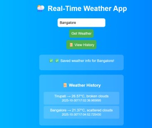

## 🌤️ Serverless Real-Time Weather App

A **fully serverless application** built on **AWS Lambda**, **API Gateway**, and **DynamoDB** — delivering **real-time weather data** with **persistent history storage**.  

Easily extensible to support **alerts**, **automation**, and **monitoring** — showcasing **full-stack serverless architecture skills**.

---
## 🧪 Sample Output


---
### 🧱 Project Overview

This application allows users to:

- 🌍 **Fetch real-time weather data** for any city (via [OpenWeather API](https://openweathermap. org/api))
- 💾 **Automatically store temperature history** in DynamoDB
- 📜 **Retrieve historical weather data** from the same endpoint

It’s **lightweight**, **scalable**, and **fully event-driven** — designed for **zero-maintenance deployments**.

---

## ⚙️ Architecture

The high-level flow of the Serverless Real-Time Weather App:

```text
User → API Gateway → AWS Lambda → OpenWeather API
↓
DynamoDB Table
```
---


### 🧭 Flow Explanation

1️⃣ **User** sends a request (e.g., `/weather?city=London`)  
2️⃣ **API Gateway** routes it to a **Lambda function**  
3️⃣ **Lambda** calls the **OpenWeather API** to fetch real-time data  
4️⃣ The response is stored in **DynamoDB** for historical tracking  
5️⃣ The result (current + historical data) is returned to the user

---

### ⚙️ Tech Stack

| Layer | Technology |
|-------|-------------|
| 🧠 **Compute** | AWS Lambda (Python 3.9) |
| 🌐 **API Gateway** | HTTP API + CORS Enabled |
| 💾 **Database** | DynamoDB (NoSQL) |
| ☁️ **External API** | OpenWeather API |

---
### 🧠 Learning Highlights

💡 Hands-on experience with **AWS Serverless Stack**  
💡 Implemented **IAM roles**, **CORS**, and **API Gateway** integrations  
💡 Learned to **connect and store data in DynamoDB**  
💡 Gained exposure to **scalable, event-driven architectures**  
💡 Built a **deployable cloud-native app** from scratch  

---
### 🧪 API Usage

#### 🟢 **POST** `/weather`

```json
Request Body:
{
  "city": "Chennai"
}

Response:
{
  "alert": "✅ Saved weather info for Chennai!"
}
```

#### 🔵 **GET**: `/weather`
```json
Response:

[
  {
    "id": "uuid-123",
    "city": "Chennai",
    "temperature": 31.5,
    "description": "clear sky",
    "timestamp": "2025-10-30T12:22:10Z"
  }
]
```
---